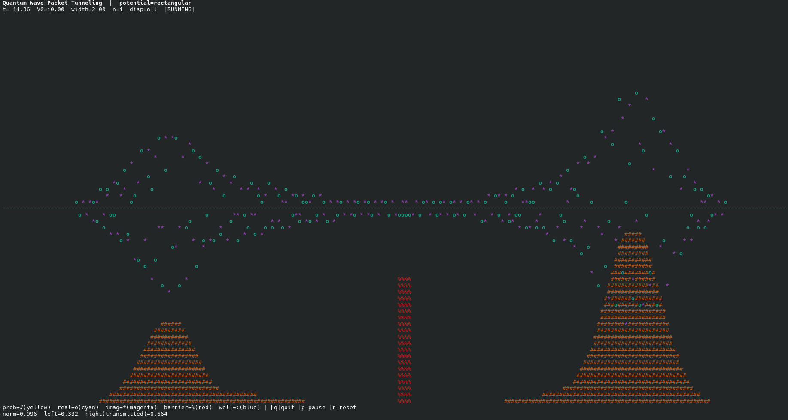
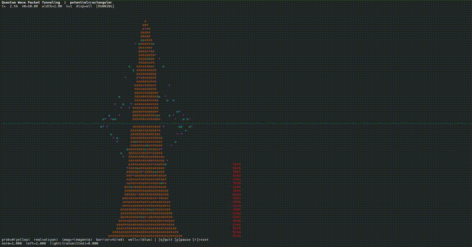

# Quantum Wave Packet Tunneling — CLI edition

A terminal (ncurses) real-time animation of a 1D quantum wave packet
hitting a potential barrier / well / harmonic potential / Coulomb
barrier, showing reflection and tunneling. Two independent
implementations are included:

| file               | language | dependencies                |
|---------------------|----------|------------------------------|
| `quantum_tunnel.py` | Python 3 | numpy, curses (stdlib)       |
| `quantum_tunnel.c`  | C99      | libc, ncurses                |

Both implement the same physics and the same command-line interface, so
pick whichever fits your environment (the C version starts faster and has
no runtime dependencies beyond ncurses; the Python version is easier to
hack on).





---

## 1. Theoretical background

### 1.1 Governing equation

We solve the 1D time-dependent Schrödinger equation in natural units
(ħ = m = 1):

$$
i \frac{\partial \psi(x,t)}{\partial t} = \left[ -\frac{1}{2}\frac{\partial^2}{\partial x^2} + V(x) \right] \psi(x,t)
$$

### 1.2 Split-step Fourier method (Strang splitting)

The right-hand side splits into a kinetic term $T = -\frac12 \partial_x^2$,
diagonal in momentum space, and a potential term $V(x)$, diagonal in
position space. Over a small time step $\Delta t$ we approximate the
propagator with a second-order (Strang) splitting:

$$
\psi(x, t+\Delta t) \approx
e^{-iV(x)\Delta t/2}\;
\mathcal{F}^{-1}\!\left[ e^{-i k^2 \Delta t/2}\; \mathcal{F}\!\left[ e^{-iV(x)\Delta t/2}\,\psi(x,t) \right] \right]
$$

i.e. half a step of the potential phase, a full step of the kinetic
phase (applied as a simple multiplication in momentum space via FFT),
then another half step of the potential phase. This is unconditionally
stable (every factor has modulus 1, so it's exactly unitary before the
absorbing term below is added) and is the standard workhorse method for
time-dependent Schrödinger-equation simulations. Both implementations
use their own compact FFT (iterative radix-2 Cooley–Tukey, O(N log N)),
so there is no dependency on FFTW or any external numerical library.

The momentum grid follows the usual FFT frequency ordering: for a domain
of length $L = 2 x_{\max}$ sampled at $N$ points,

$$
k_i = \begin{cases} 2\pi i / L & i < N/2 \\ 2\pi (i-N)/L & i \ge N/2 \end{cases}
$$

### 1.3 Absorbing boundary (open boundary condition)

An FFT-based method is implicitly periodic — a wave packet leaving the
right edge would reappear on the left. To emulate an open system (the
packet "disappears once it reaches the edge of the screen") and to
suppress that wraparound aliasing, a complex absorbing potential (CAP)
$-i\Gamma(x)$ is added near the domain edges:

$$
V_{\text{eff}}(x) = V(x) - i\,\Gamma(x), \qquad
\Gamma(x) = \eta \left[ \frac{\max(0,\, |x| - (x_{\max}-w))}{w} \right]^2
$$

where $w$ is the absorbing-layer width (`--absorb-width`, a fraction of
the domain) and $\eta$ is its strength (`--absorb-strength`). Substituting
$V_{\text{eff}}$ into the propagator above adds a real, non-unitary decay
factor $e^{-\Gamma(x)\Delta t}$ that smoothly damps the amplitude before
it reaches the boundary, without introducing spurious reflections (unlike
a hard wall or an abrupt cutoff).

### 1.4 Initial condition: Gaussian wave packet

$$
\psi(x,0) = (2\pi\sigma^2)^{-1/4}\, \exp\!\left[-\frac{(x-x_0)^2}{4\sigma^2}\right] \exp[i k_0 x]
$$

a minimum-uncertainty Gaussian centered at $x_0$ with spatial width
$\sigma$ (`--sigma`) and mean momentum $k_0$ (`--k0`), so the mean
kinetic energy is approximately $E_0 = k_0^2/2$.

### 1.5 Potentials

| `--potential`  | formula | notes |
|----------------|---------|-------|
| `rectangular` (default) | $V(x)=V_0$ for $x\in[c_i-w/2,\,c_i+w/2)$, else 0 | one or more barriers (`--num-barriers`), centered at $c_i = (i-\tfrac{n-1}{2})\,s$ with spacing $s$ (`--spacing`, default $3w$) |
| `well` | same shape, $V_0 = -\lvert\text{height}\rvert$ | attractive square well(s) |
| `harmonic` | $V(x) = \tfrac12\omega^2 x^2$, with $\omega^2 = 2\,\text{height}/\text{width}^2$ | `--width` sets the curvature via $V(\text{width}) = \text{height}$ |
| `coulomb` | $V(x) = \dfrac{\text{height}}{\sqrt{x^2+\varepsilon^2}}$ | repulsive 1/r barrier, softened by $\varepsilon = $ `--width` to avoid the $x=0$ singularity — the same shape of barrier tunneled through in alpha decay and nuclear fusion (Gamow's theory) |

### 1.6 What the numbers on screen mean

`norm` is $\int|\psi|^2\,dx$ (should start at 1.0 and only decrease once
probability reaches the absorbing layer or tunnels through and leaves).
`left`/`right` are the same integral restricted to $x<0$ / $x\ge 0$, a
quick way to see how much of the packet has been reflected vs.
transmitted through a barrier centered at the origin.

---

## 2. Build & run

### Python version

```bash
python3 quantum_tunnel.py
```
Requires `numpy` (`pip install numpy --break-system-packages` if needed).
`curses` ships with the Python standard library on Linux/macOS.

### C version

```bash
gcc -O2 -std=c99 -o quantum_tunnel quantum_tunnel.c -lncurses -lm
./quantum_tunnel
```
Arch Linux: `sudo pacman -S ncurses` (usually already installed).
Debian/Ubuntu: `sudo apt install libncurses-dev`.

---

## 3. Controls

`q` quit · `p` pause/resume · `r` reset the wave packet

## 4. Command-line options

Both versions share the same flags:

| flag | meaning | default |
|------|---------|---------|
| `--potential {rectangular,well,harmonic,coulomb}` | potential type | `rectangular` |
| `--height V` | barrier height / well depth / curvature or Coulomb scale | `15.0` |
| `--width W` | barrier width / harmonic curvature width / Coulomb softening length | `2.0` |
| `--num-barriers N` | number of barriers/wells (ignored for harmonic/coulomb) | `1` |
| `--spacing S` | center-to-center spacing for multiple barriers | `width*3` |
| `--k0 K` | initial momentum (mean kinetic energy $\approx k_0^2/2$) | `5.0` |
| `--sigma S` | initial spatial width of the wave packet | `3.0` |
| `--x0 X` | initial position | `-xmax*0.6` |
| `--xmax X` | half-width of the domain $[-x_{\max}, x_{\max}]$ | `60.0` |
| `--grid-points N` | grid points (rounded up to a power of 2 for the FFT) | `2048`–`3000`* |
| `--dt DT` | simulation time step | `0.005` |
| `--steps-per-frame N` | time steps per rendered frame | `8` |
| `--fps F` | render frame rate | `24` |
| `--display {prob,real,imag,all}` | what to plot | `prob` |
| `--absorb-strength S` | absorbing-boundary strength $\eta$ | `6.0` |
| `--absorb-width W` | absorbing-layer width, fraction of domain | `0.15` |
| `--no-loop` | don't auto-restart after the packet is absorbed | off |

\* Python default is 3000 grid points (no power-of-2 constraint, uses
`numpy.fft`); the C version rounds up to 2048 by default since it uses a
radix-2 FFT.

## 5. Examples

```bash
# Real/imaginary part + probability density overlaid
python3 quantum_tunnel.py --display all

# A finite square well
python3 quantum_tunnel.py --potential well --height 8 --width 4

# Bound state in a harmonic trap
python3 quantum_tunnel.py --potential harmonic --height 20

# Three evenly spaced barriers (a simple superlattice)
python3 quantum_tunnel.py --potential rectangular --num-barriers 3 --spacing 6 --height 12

# Coulomb barrier — alpha-decay-style tunneling
./quantum_tunnel --potential coulomb --height 20 --width 3 --display all
```
